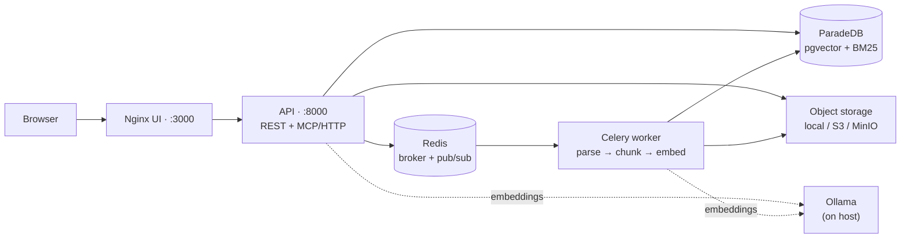
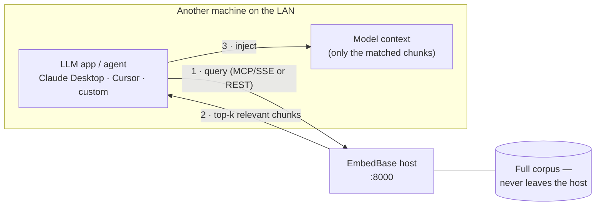

# EmbedBase


**A local-first, open-source document embedding system.** Ingest documents, search them with hybrid semantic + keyword retrieval, and expose results over a REST API and an MCP server — all without your data leaving your machine.

---

## Table of contents

- [Features](#features)
- [Architecture](#architecture)
- [Prerequisites](#prerequisites)
- [🚀 Quickstart](#-quickstart)
- [Configuration](#configuration)
- [Embedding providers](#embedding-providers)
- [📦 Object storage (local / S3 / MinIO)](#-object-storage-local--s3--minio)
- [Document parsers (OCR, DOCX/PPTX, GPU)](#document-parsers-ocr-docxpptx-optional-gpu)
- [MCP (Claude Desktop / Cursor / Zed)](#mcp-claude-desktop--cursor--zed)
  - [Claude Code](docs/mcp-claude-code.md)
- [Ports](#ports)
- [WSL2 notes](#wsl2-notes)
- [License](#license)

---

## Features

- **Hybrid search** — semantic (pgvector) fused with BM25 keyword ranking (ParadeDB `pg_search`) in a single SQL round-trip.
- **Two APIs** — a REST API (`/docs` for OpenAPI) and an MCP server over streamable HTTP for Claude Desktop, Cursor, and Zed.
- **Pluggable embeddings** — Ollama, sentence-transformers, any OpenAI-compatible endpoint, or Google Gemini.
- **Pluggable storage** — uploaded files live on local disk by default, or on any number of S3-compatible backends (self-hosted MinIO, AWS S3, …).
- **Document parsing** — PDF (fast PyMuPDF or OCR-capable docling), Markdown, and plain text out of the box; DOCX/PPTX when the docling backend is enabled — with optional NVIDIA GPU acceleration.
- **Live config** — most settings are editable at runtime from the Settings UI (or `PUT /config`) with no restart.

## Architecture



Everything ships as containers via Docker Compose. The **API** serves requests, the **worker** runs the ingestion pipeline, **ParadeDB** (Postgres + pgvector + `pg_search`) holds vectors, metadata, and the lexical index, **Redis** is the task broker and realtime bus, and **Nginx** serves the UI and proxies the API. Embeddings are computed by an external provider — by default **Ollama running on the host**.

### Networked retrieval — LLMs on other machines

This is the whole point of running EmbedBase on a host other machines can reach: **give a model access to a large corpus without loading it into the model's context.** Any LLM app or agent that can see the server queries it and pulls back only the handful of relevant chunks for the question at hand. The corpus stays on the EmbedBase host; only the top-k matches ever cross the network and enter the model's context window.



Any [MCP](#mcp-claude-desktop--cursor--zed) client (or the REST search API) works — point it at the host's LAN address, `http://<host-lan-ip>:8000/api/mcp/`, instead of `localhost`. Set `LAN_HOST` in `.env` so the server advertises a reachable address (a bridge-networked container can't detect the host's LAN IP itself). Because it's now reachable beyond your own machine, keep `MASTER_API_KEY` strong and set `EMBEDBASE_SECURE_HEADERS=true`.

## Prerequisites

| Requirement | Notes |
|---|---|
| **Docker Engine + Docker Compose v2** | The whole stack runs in containers. |
| **Ollama** (host) | Needed for the *default* embedding provider. Install from [ollama.com](https://ollama.com), then `ollama pull embeddinggemma`. Prefer no external service? Switch the provider to `sentence_transformers` (see [Embedding providers](#embedding-providers)). |
| **WSL2** (Windows only) | Clone and run inside the Linux filesystem; allocate ≥ 8 GB RAM. See [WSL2 notes](#wsl2-notes). |
| **NVIDIA Container Toolkit** (optional) | Only for GPU-accelerated OCR/parsing — see [Document parsers](#document-parsers-ocr-docxpptx-optional-gpu). The default CPU stack has zero NVIDIA dependencies. |

## 🚀 Quickstart

```bash
# 1. Clone inside WSL2 (~/, NOT /mnt/c — see WSL2 notes)
git clone https://github.com/jaymeklein/embedbase
cd embedbase

# 2. Embedding model (default provider = Ollama on the host)
ollama pull embeddinggemma          # 768-dim, multilingual

# 3. Secrets — copy the templates, then edit .env
cp .env.example .env
cp config.example.yaml config.yaml
```

Set **both required secrets** in `.env` (the stack will not start without them):

```dotenv
# A random 32+ char string — the only application secret
MASTER_API_KEY=<paste output of: python -c "import secrets; print(secrets.token_urlsafe(32))">

# Any non-empty password — ParadeDB refuses to boot without it
POSTGRES_PASSWORD=<choose a strong password>
```

```bash
# 4. Build and start (first run pulls images + ML deps)
docker compose up --build
```

| Service | URL |
|---|---|
| **UI** | http://localhost:3000 |
| **API** | http://localhost:8000 |
| **API docs (OpenAPI)** | http://localhost:8000/docs |

Open the UI, create a workspace and collection, and drop in a document to ingest.

## Configuration

Configuration is split in two, by intent:

| File | Owns | Reloads |
|---|---|---|
| **`.env`** | Deploy/bootstrap values needed *before* the app starts — secrets, ports, Redis/DB connection, CORS, log level. | Restart required. |
| **`config.yaml`** | Application domain settings — embedding, chunking, parsers, search, MCP, object storage. | **Live** — edit in the Settings UI or `PUT /config`, no restart. |

Secrets (API keys, S3 credentials, DB password) always live in `.env`, never in `config.yaml`. Start from `.env.example` and `config.example.yaml`, both of which document every option inline.

## Embedding providers

The default is **Ollama** with `embeddinggemma` (768-dim, multilingual), reached at `http://host.docker.internal:11434`. Change the provider in `config.yaml` (or the Settings UI):

```yaml
embedding:
  provider: ollama          # ollama | sentence_transformers | openai_compat | gemini
  model: embeddinggemma
  batch_size: 32
```

| Provider | Runs where | Setup |
|---|---|---|
| `ollama` *(default)* | Host process | Install Ollama, `ollama pull <model>`. |
| `sentence_transformers` | In-process (API + worker) | No external service; weights download from Hugging Face on first use. **The zero-dependency option.** |
| `openai_compat` | Any OpenAI-compatible HTTP endpoint (LM Studio, vLLM, …) | Set `base_url` + `api_key`. |
| `gemini` | Google AI | Set `api_key` (Google AI Studio). |

## 📦 Object storage (local / S3 / MinIO)

Uploaded files are addressed by a `{collection_id}/{document_id}{ext}` key and stored through a **pluggable registry of named backends**. Out of the box everything is written to **local disk** — no S3, no MinIO, nothing to configure. Opt into S3-compatible storage by declaring a backend in `config.yaml` and pointing `storage.default` at it.

Key properties:

- **Multiple backends coexist.** Each document records *which* backend holds it (`storage_backend`), so adding or switching targets never orphans existing files.
- **Downloads are presigned.** Files on an S3 backend are served as a short-lived (1 h) redirect to the object; local files stream directly.
- **Zero-touch bucket setup.** On first use the app creates the bucket if missing and applies a `GET` CORS rule for your `CORS_ORIGINS`, so browser downloads work cross-origin.

The registry lives under `storage:` in `config.yaml` (commented out by default):

```yaml
storage:
  default: local            # backend new uploads go to
  backends:
    local:
      type: local           # files under the upload volume; always available
    minio:
      type: s3
      endpoint_url: http://minio:9000            # in-cluster address (api/worker → minio)
      public_endpoint_url: http://localhost:9000 # address the BROWSER reaches (signs presigned URLs)
      bucket: embedbase
      region: us-east-1
      use_path_style: true
    aws:
      type: s3
      bucket: my-prod-bucket
      region: eu-west-1
```

### Local disk (default)

Nothing to do. Files are written to the `embedbase_data` volume (`/data` in the container). This is exactly the pre-storage behavior.

### Bundled MinIO (opt-in)

A self-hosted MinIO ships as an opt-in Compose override — it is **never** built or run by the default stack.

1. In `config.yaml`, uncomment the `storage:` block above (the `minio` backend is already defined). Leave `default: local`; the override sets `STORAGE_DEFAULT=minio` for you.
2. In `.env`, set the MinIO secret (it doubles as the MinIO root password, so **≥ 8 chars**):
   ```dotenv
   S3__MINIO__ACCESS_KEY_ID=embedbase          # also the MinIO root user (default: embedbase)
   S3__MINIO__SECRET_ACCESS_KEY=<≥ 8 chars>    # also the MinIO root password
   ```
3. Start with the override merged in:
   ```bash
   docker compose -f docker-compose.yml -f docker-compose.minio.yml up -d --build
   ```
4. MinIO console: http://localhost:9001 (log in with the key/secret above). Upload a document in the UI → the object appears in the `embedbase` bucket; downloading it 302-redirects to `http://localhost:9000/...`.

### External S3 (AWS or any S3-compatible)

No container needed — pure config.

1. In `config.yaml`, keep (or adapt) the `aws` backend and select it:
   ```yaml
   storage:
     default: aws
     backends:
       local: { type: local }
       aws:
         type: s3
         bucket: my-prod-bucket
         region: eu-west-1
         use_path_style: false   # AWS uses virtual-hosted style; leave endpoint_url unset
   ```
2. In `.env`, provide the credentials (or omit both to use an instance role / the default AWS credential chain):
   ```dotenv
   S3__AWS__ACCESS_KEY_ID=AKIA...
   S3__AWS__SECRET_ACCESS_KEY=...
   ```
3. Start the normal stack — no override file:
   ```bash
   docker compose up -d
   ```

### Backend field reference

Each `type: s3` backend accepts:

| Field | Default | Meaning |
|---|---|---|
| `bucket` | `embedbase` | Bucket objects are stored in (auto-created on first use if missing). |
| `region` | `us-east-1` | AWS region; any value for MinIO. |
| `endpoint_url` | *(none)* | In-cluster S3 endpoint the api/worker call. Leave **unset** for real AWS. |
| `public_endpoint_url` | *(→ `endpoint_url`)* | Host the browser reaches; presigned URLs are signed for it. |
| `use_path_style` | `true` | `true` for MinIO (path-style), `false` for AWS (virtual-hosted). |
| `access_key_id` / `secret_access_key` | *(from `.env`)* | **Do not set here.** Injected as `S3__<NAME>__ACCESS_KEY_ID` / `S3__<NAME>__SECRET_ACCESS_KEY`. Omit both to fall back to the AWS default credential chain. |

> **Naming:** the env override for a backend named `minio` is `S3__MINIO__…`. Name backends with `[A-Za-z0-9_]` only — a `-` or `.` produces an env var name shells and Compose can't set.

## Document parsers (OCR, DOCX/PPTX, optional GPU)

PDFs default to the fast PyMuPDF parser (~10 ms/page) — best for text-heavy
documents. For scanned PDFs or table extraction, switch to the
[docling](https://github.com/docling-project/docling) backend in `config.yaml`:

```yaml
parsers:
  pdf_backend: docling   # OCR + table structure (CPU ~200-800 ms/page)
  docling_ocr: true
  docling_tables: true
```

`.docx` and `.pptx` have no lightweight adapter, so they require the docling backend
(`pdf_backend: docling`). With docling off (the default) an office-format upload is
rejected at the API with a `415` rather than failing later in the worker. docling models
download lazily on first use; pre-bake them with `--build-arg EMBEDBASE_DOCLING_MODELS=true`.

**GPU acceleration (NVIDIA RTX only)** brings docling to ~30-80 ms/page:

```bash
docker compose -f docker-compose.yml -f docker-compose.gpu.yml up
```

This requires the NVIDIA Container Toolkit and a CUDA-matched torch build. The
default `cu128` wheels in `worker/Dockerfile.gpu` cover every GPU from Turing/RTX
20 upward; only swap the `cu1XX` wheel (see
[pytorch.org/get-started/locally](https://pytorch.org/get-started/locally/)) for
an older driver. The default CPU stack has zero NVIDIA dependencies.

**No config needed — the GPU is auto-detected.** `parsers.docling_device`
defaults to `auto`: on startup the worker checks for a CUDA device and, if found,
selects it and bumps the OCR/layout batch sizes (64) automatically; with no GPU
it transparently falls back to CPU. Pin `cpu`/`cuda` only if you want to override
detection.

**Flash Attention 2 is Ampere-only** (compute capability ≥ 8.0 — RTX 30/40). It
is auto-enabled under `auto` only when both the GPU supports it *and* `flash-attn`
is installed (built via `--build-arg INSTALL_FLASH_ATTN=true`). Turing cards (RTX
20 series, e.g. the 2060 Super at 7.5) auto-select CUDA without flash. Forcing
`docling_flash_attention: true` on a sub-Ampere GPU fails fast with a clear error.

## MCP (Claude Desktop / Cursor / Zed)

EmbedBase exposes an MCP server over **streamable HTTP** at
`http://localhost:8000/api/mcp/` (the API runs with `root_path="/api"`, so the
endpoint carries the `/api` prefix; note the trailing slash). Claude Desktop
bridges to a *remote* HTTP server via
[`mcp-remote`](https://www.npmjs.com/package/mcp-remote). Add to
`~/Library/Application Support/Claude/claude_desktop_config.json` (macOS) or
`%APPDATA%\Claude\claude_desktop_config.json` (Windows):

```json
{
  "mcpServers": {
    "embedbase": {
      "command": "npx",
      "args": [
        "-y", "mcp-remote",
        "http://localhost:8000/api/mcp/",
        "--header", "Authorization: Bearer ${EMBEDBASE_MASTER_KEY}"
      ],
      "env": {
        "EMBEDBASE_MASTER_KEY": "<your MASTER_API_KEY>"
      }
    }
  }
}
```

Authenticate with your `MASTER_API_KEY`. Each key is limited to 60 requests/min;
the 61st in a minute returns `429`. Change it in **Settings → Config → MCP
server** — the new limit applies to the next MCP request, no restart. (Setting
`mcp.rate_limit_rpm` in `config.yaml` works too, but is only read at startup.)

**Authenticate with your `MASTER_API_KEY` _or_ a per-user key** — a user key acts as that user and
respects their read/write grants, so a whole team can drive EmbedBase from chat without console access.

**Tools** (a full self-service surface — every action a user has in the console except admin config):
- *Search / read* — `list_workspaces`, `search_documents` (`query`, `collection_ids[]`, `top_k`, `hybrid`,
  `filters`), `list_documents`, `get_document_chunks`
- *Documents* — `request_upload` + `confirm_upload` (presigned upload, with optional `retention_days` 1–30),
  `download_document`, `get_document_status`, `reprocess_document`, `delete_document`, `ingest_document`
  (container-local path, master-only)
- *Structure* — create/update/delete for workspaces and collections
- *Tags* — list/create/update/delete/merge + assign/unassign (needs the `manage_tags` permission)
- *Ops* — `list_ingestion_jobs`, `get_ingestion_stats`, `get_rate_limit`

### Claude Code

To register the server with [Claude Code](https://claude.com/claude-code) via
`claude mcp add`, see **[docs/mcp-claude-code.md](docs/mcp-claude-code.md)**.
Use the `/api`-prefixed path with a trailing slash — `http://localhost:8000/api/mcp/`
(or `http://<console>/api/mcp/` through the proxy):

```bash
KEY=$(grep '^MASTER_API_KEY=' .env | cut -d= -f2)
claude mcp add --transport http embedbase \
  http://localhost:8000/api/mcp/ \
  --header "Authorization: Bearer $KEY"
```

## Ports

Host ports are configurable in `.env` (change them if the defaults conflict; run `python scripts/check_ports.py` to detect conflicts).

| Port | Service | `.env` var | Notes |
|---|---|---|---|
| `3000` | Nginx / UI | `UI_PORT` | Primary entrypoint. |
| `8000` | API | `API_PORT` | REST + MCP/HTTP. Remove this mapping on shared networks (Nginx is the only ingress). |
| `5432` | ParadeDB | `POSTGRES_HOST_PORT` | Bound to `127.0.0.1` for a local DB GUI; never exposed on the LAN. |
| `9000` / `9001` | MinIO API / console | `MINIO_PORT` / `MINIO_CONSOLE_PORT` | Only with `docker-compose.minio.yml`. |

## WSL2 notes

- Clone inside the WSL2 filesystem (`~/`) — not `/mnt/c/`
- Allocate at least 8 GB RAM in `%UserProfile%\.wslconfig`
- Use `host.docker.internal` to reach services on the Windows host (e.g. Ollama)

## License

Apache 2.0
